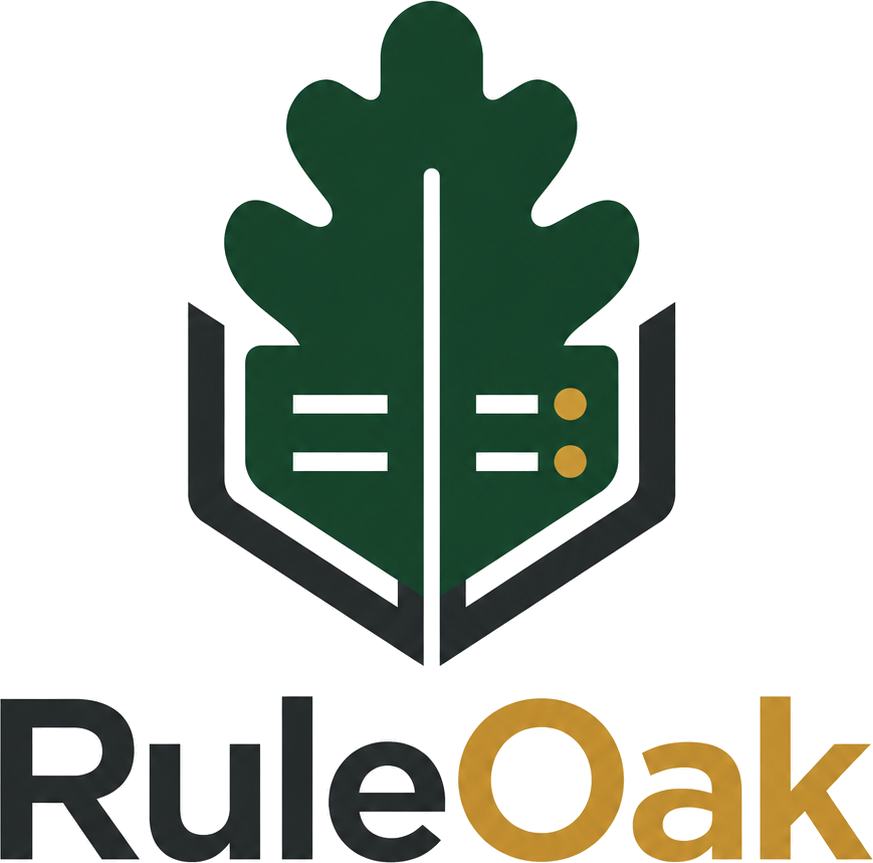

<p align="center">
  
</p>

# RuleOak Core v2.1.0

> **Govern AI tool calls before they run.**
>
> RuleOak Core is a TypeScript runtime library for governing AI tool calls before execution. It provides guard and policy checks, approval gates, evidence records, audit reports, and protocol conformance tools.

```text
Declare tool call → Evaluate policy → Decide allow / approve / block → Pause for approval when required → Record evidence and audit events → Validate and export audit report
```

RuleOak adds governance for AI tool calls by evaluating proposed actions before execution and recording the decision, evidence, approval state, and audit events.

RuleOak Core is for developers building AI agents, MCP-style tools, LangGraph/CrewAI workflows, local LLM workflows, and vertical AI apps where unchecked tool execution is not acceptable.

- Latest public release: **v2.1.0**
- Previous public release: **v2.0.3**
- Earlier public baseline: **v1.0.1**
- Stable governance protocol: **ruleoak.governance.v1**
- License: **AGPL-3.0-or-later**

[Website](https://ruleoak.com) · [Start in 10 minutes](docs/adoption/10-minute-quickstart.md) · [Developer usage](docs/adoption/developer-usage.md) · [Governance Protocol v1](docs/protocol/governance-records-v1.md) · [Conformance Kit](docs/protocol/conformance-kit.md) · [Claims language](docs/trust/claims-language.md)

---

## 60-second demo


The demo follows the same sequence used in the quickstart, examples, and documentation:

1. Declare the tool call.
2. Evaluate policy before execution.
3. Decide **allow / approve / block**.
4. Pause for approval when required.
5. Record evidence and audit events.
6. Validate and export an audit report.

---

## Start in 10 minutes

```bash
npm install
npm run quickstart:all
npm run protocol:conformance
npm run product:surface:demo
```

Expected decisions:

| Proposed tool call | Decision | Why |
|---|---|---|
| `search_docs` | allowed | read-only local evidence action |
| `send_external_message` | approval required | external communication needs review |
| `delete_workspace_file` | denied | destructive action is blocked before execution |

Open generated reports under:

```text
reports/html/
```

For the guided first-run check:

```bash
npm run launch
```

---

## How developers use RuleOak Core

### Path A — GitHub release / source preview

Use this path to inspect the code, run examples, review generated governance records, and decide whether RuleOak fits your agent stack.

```bash
git clone https://github.com/ruleoak/ruleoak-core.git
cd ruleoak-core
npm install
npm run quickstart:all
npm run protocol:conformance
```

### Path B — Local package install from release tarball

Use this path to try RuleOak Core inside your own TypeScript or Node.js project before using an npm registry package.

```bash
cd ruleoak-core
npm install
npm pack
cd ../your-agent-project
npm install ../ruleoak-core/ruleoak-core-2.1.0.tgz
```

Then wrap one tool-call boundary in your app and route the proposed action through RuleOak before execution.

---

## Developer value

| Developer need | RuleOak provides |
|---|---|
| Add governance without redesigning the app | tool-call boundary helpers, guard modules, policy packs, adapter examples |
| Keep policy outside prompts | explicit guard and policy checks before execution |
| Pause risky actions | approval gates, reviewer context, approval packets |
| Block dangerous actions | allow / approval-required / deny decisions before a tool runs |
| Explain what happened | evidence records, audit events, run records, report records |
| Validate compatibility | `ruleoak.governance.v1` schemas and conformance kit |
| Review locally | local reports, Audit Report Viewer v2, offline verification |

RuleOak is not an agent orchestrator. It sits at the action boundary and governs what the agent wants to do.

---

## What is included in v2.1.0

| Area | Included |
|---|---|
| Runtime library | TypeScript/Node.js modules for governing tool-call requests |
| Tool Guard | evaluate proposed tool calls before execution |
| Policy packs | reusable, scenario-tested, signed governance defaults |
| Approval gates | local approval inbox, reviewer notes, evidence requests, approval packets |
| Evidence and audit | run, evidence, approval, policy, audit, and report records |
| Audit reports | JSON/HTML reports, Audit Report Viewer v2, exportable audit packets |
| Protocol v1 | stable `ruleoak.governance.v1` schemas, golden records, replay checks, conformance kit |
| Adapter examples | MCP, LangGraph, CrewAI, coding-agent boundary examples |
| Evidence connectors | read-only GitHub/Jira examples and enterprise connector fixtures |
| Integrity | signed policy packs, evidence bundles, and audit-chain verification |
| Safety boundary tests | filesystem, network, command, connector, and MCP safety tests |

---

## Quick commands

```bash
# First-run path
npm run quickstart:all
npm run protocol:conformance
npm run product:surface:demo

# Developer-facing examples
npm run coding:agent-governance
npm run rag:answer-governance
npm run personal:local-assistant-governance
npm run sre:monitoring-change

# Guards, policy, and protocol proof
npm run policy:pack:validate
npm run policy:pack:scenarios
npm run integrity:verify
npm run protocol:kit

# Approval and audit proof
npm run approval:ux:v2:check
npm run audit:viewer:v2:check
npm run product:surface:check

# Release validation
npm run launch:check
npm run release:public-check
npm test
```

---

## Protocol Conformance Kit

Use the standalone kit when another SDK, adapter, or vertical app needs to claim compatibility with `ruleoak.governance.v1`:

```bash
npm run protocol:kit
npm run protocol:kit:json
```

Preferred compatibility wording:

> Compatible with `ruleoak.governance.v1` using the RuleOak Protocol Conformance Kit.

Do not call compatibility certified, audited, regulator-approved, or compliance-approved unless you have separate independent evidence.

---

## Safety boundary

RuleOak provides a tested governance boundary for tool calls routed through RuleOak. It is an application-level governance boundary, not a complete sandbox or compliance certification. It is not a certified compliance product. It does **not** claim to be:

- a certified compliance product;
- an externally security-reviewed sandbox;
- a hosted cloud service;
- a guarantee that an AI system is safe;
- a replacement for enterprise security controls.

Use the precise claim:

> RuleOak can block or require approval for dangerous tool calls before execution when integrated into the tool-call path.

---

## Trust, security, and licensing

Start here:

- [Security model](docs/trust/security-model.md)
- [Claims language guide](docs/trust/claims-language.md)
- [AGPL and commercial boundary](docs/trust/agpl-commercial-boundary.md)
- [Validation matrix](docs/trust/validation-matrix.md)
- [Release notes](RELEASE_NOTES.md)
- [Contributing](CONTRIBUTING.md)

RuleOak Core is licensed under **AGPL-3.0-or-later**. See [LICENSE](LICENSE), [NOTICE](NOTICE), and [license FAQ](docs/license-faq.md).

---

## Contributing

RuleOak is currently in a feedback-first contribution stage. Issues and Discussions are welcome. Pull requests may be restricted while contribution governance and licensing processes are finalized.

See [CONTRIBUTING.md](CONTRIBUTING.md).
