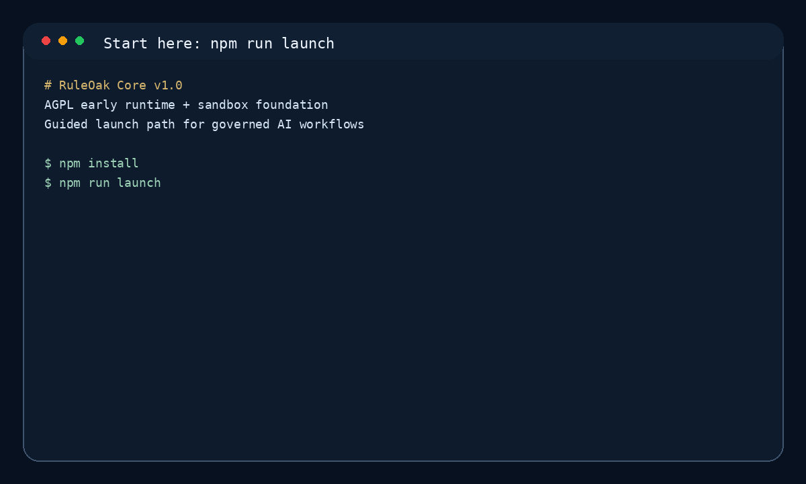

<p align="center">
  
</p>

# RuleOak Core v1.0

**RuleOak Core is an AGPL early runtime for governed AI workflows.**

It helps developers build agentic workflows where important actions are checked by policy, grounded in evidence, gated by approval when needed, and recorded for audit-style review.

```text
policy → evidence → approval → audit
```

RuleOak is for builders who want AI agents to be useful without letting them act recklessly.

## Start here

```bash
npm install
npm run launch
```

The launch command runs the first-user flow: examples list, Technical Consultant demo, Research Brief demo, sandbox demo, HTML report generation, and next-step guidance.

Useful commands:

```bash
npm run demo
npm run sandbox:demo
npm run report:view
npm run onboard
npm test
```

## What v1.0 includes

| Area | Included in v1.0 |
|---|---|
| Runtime | Run manager, policy engine, evidence store, approval gate, audit log, report exporter |
| Sandbox foundation | Filesystem, network, command, and tool policy guards with deny-by-default behavior |
| Demos | Technical Consultant demo and Research Brief demo |
| Launch UX | `npm run launch`, `npm run demo`, workflow chooser, templates, one-page HTML reports, local report viewer |
| Local LLM readiness | Hardware check, starter Ollama model recommendation, smoke test helpers |
| Quality signals | Tests, CI workflow, screenshots, demo GIF, threat-model docs |

## Two-minute demo



The GIF shows the v1.0 first-user path:

```bash
npm install
npm run launch
npm run demo
npm run report:view
```

It covers the guided launch command, consultant demo, research demo, sandbox demo, generated one-page HTML reports, and the local browser-based report viewer.

A recording script is available at [docs/demo-video-script.md](docs/demo-video-script.md).

## Why RuleOak exists

Most agent frameworks help agents do more. RuleOak focuses on a different question:

> What is the agent allowed to do, what evidence supports it, who approves it, and what record remains afterward?

That makes RuleOak useful for serious workflows such as technical diagnosis, research briefs, review workflows, operational assistants, document analysis, and other vertical AI applications where uncontrolled action is not acceptable.

## Runtime lifecycle

A RuleOak run follows a simple control path:

```text
create run
→ start run
→ collect evidence
→ evaluate proposed action
→ request approval if needed
→ record audit events
→ export report
```

Inspect the runtime:

```bash
npm run runtime:inspect
```

## Sandbox foundation

RuleOak Core v1.0 includes a deny-by-default sandbox foundation. It is a security foundation control layer with automated tests and documentation. It is **not** an externally security-reviewed sandbox yet.

```bash
npm run sandbox:inspect
npm run sandbox:demo
npm run test:sandbox
```

The sandbox evaluates:

- filesystem reads and writes;
- localhost versus external network calls;
- command allow, deny, and approval-required decisions;
- registered tool decisions.

## Examples

```bash
npm run examples:list
npm run example:consultant
npm run example:research
```

| Example | What it shows |
|---|---|
| Technical Consultant Demo | Evidence-backed case analysis, probable cause, recommended action, approval boundary, audit-style report |
| Research Brief Demo | Sourced claims, confidence, known unknowns, recommendation, publishing approval boundary |

Read [docs/examples-matrix.md](docs/examples-matrix.md).

## HTML reports and local viewer

Generate one-page reports:

```bash
npm run report:html
```

Open a local-only browser viewer:

```bash
npm run report:view
```

The viewer serves reports at `http://127.0.0.1:8787/` from your machine. It is not a hosted cloud service.

## Create your own workflow

```bash
npm run roak:init -- my-workflow --template=consultant-workflow
npm run roak:init -- my-research --template=research-workflow
npm run roak:init -- my-minimal --template=minimal-governed-workflow
```

Each template gives you a small policy, sample input, and workflow notes so you can adapt the RuleOak pattern to your own domain.

## Local LLM readiness

```bash
npm run llm:doctor
npm run llm:pull
npm run llm:smoke
```

The local LLM helper checks your machine and recommends a starter Ollama model. It is onboarding guidance, not a benchmark.

## What v1.0 is not

RuleOak Core v1.0 is not yet:

- a mature enterprise platform;
- an externally security-reviewed sandbox;
- a certified compliance product;
- a hosted cloud service;
- a finished vertical application.

The current release is an early runtime foundation for learning, prototyping, and building governed workflows.

## Documentation

| Need | Start here |
|---|---|
| Quickstart | [docs/quickstart.md](docs/quickstart.md) |
| Runtime lifecycle | [docs/runtime-lifecycle.md](docs/runtime-lifecycle.md) |
| Sandbox foundation | [docs/sandbox-foundation.md](docs/sandbox-foundation.md) |
| Threat model | [docs/security/threat-model.md](docs/security/threat-model.md) |
| Build a vertical workflow | [docs/build-a-vertical.md](docs/build-a-vertical.md) |
| Local LLM readiness | [docs/local-llm.md](docs/local-llm.md) |
| License FAQ | [docs/license-faq.md](docs/license-faq.md) |
| Brand rationale | [docs/brand-rationale.md](docs/brand-rationale.md) |

## License

RuleOak Core is licensed under **AGPL-3.0-or-later**. See [LICENSE](LICENSE) and [docs/license-faq.md](docs/license-faq.md).
