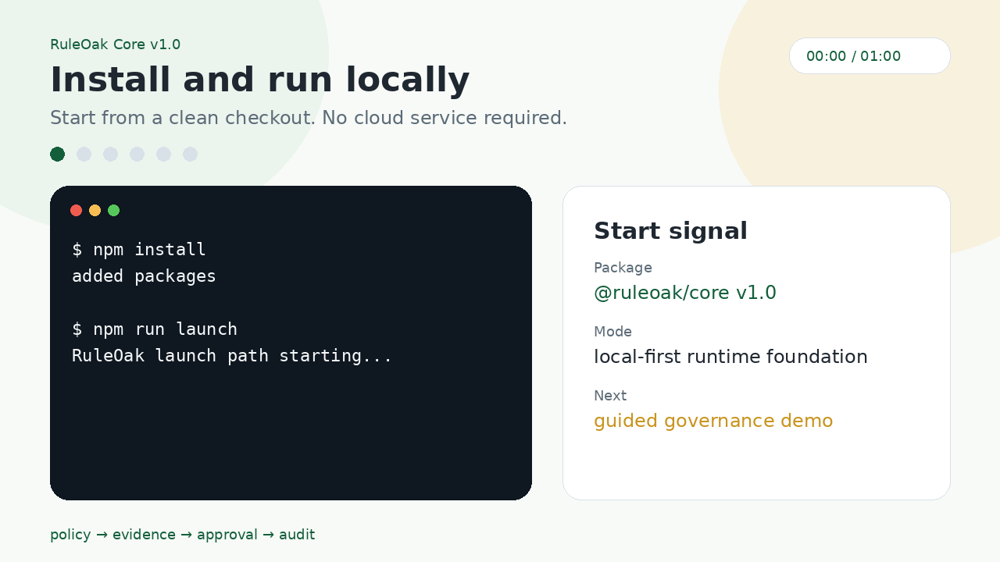

<p align="center">
  
</p>

# RuleOak Core v1.0

**Policy, evidence, approval, and audit for AI workflows that need accountable action.**

RuleOak Core helps developers build AI workflows where important actions are checked before execution, grounded in evidence, paused for approval when needed, and recorded for review.

```text
proposed action → policy decision → evidence → approval gate → audit report
```

## Try it in two commands

```bash
npm install
npm run launch
```

The launch flow runs the first-user path: examples list, governed demos, sandbox demo, HTML report generation, and next-step guidance.

## 60-second demo



The demo path shows:

```text
install → launch → policy decision → evidence → approval → audit report
```

Useful commands:

```bash
npm run demo
npm run sandbox:demo
npm run report:view
npm run onboard
npm test
```

## What RuleOak is for

Use RuleOak when an agent or AI workflow needs to answer these questions clearly:

| Question | RuleOak concept |
|---|---|
| Is this action allowed? | Policy decision |
| What supports this recommendation? | Evidence record |
| Does a human need to approve it? | Approval gate |
| What happened during the run? | Audit log and report |
| Can tool/file/network actions be bounded? | Sandbox foundation |

RuleOak is useful for technical diagnosis, research workflows, review systems, operational assistants, document analysis, and other vertical AI applications where unchecked action is not acceptable.

## What v1.0 includes

| Area | Included in v1.0 |
|---|---|
| Runtime | Run manager, policy engine, evidence store, approval gate, audit log, report exporter |
| Sandbox foundation | Filesystem, network, command, and tool policy guards with deny-by-default behavior |
| Demos | Technical Consultant demo and Research Brief demo |
| Launch UX | `npm run launch`, `npm run demo`, workflow chooser, templates, one-page HTML reports, local report viewer |
| Python bridge | `ruleoak-py v0.1.0` companion SDK for RuleOak Core v1.0-compatible governance records |
| Local LLM readiness | Hardware check, starter Ollama model recommendation, smoke test helpers |
| Quality signals | Tests, CI workflow, demo GIF, threat model docs, good-first-issue list |

## JavaScript/TypeScript and Python

RuleOak Core is the canonical runtime foundation.

Python builders can use the companion SDK:

```bash
cd ruleoak-py
python -m pip install -e .
python examples/generic_governance_example.py
```

The Python SDK emits RuleOak Core v1.0-compatible run, evidence, approval, audit, policy decision, and report records. It is a bridge, not a fork of the runtime.

Read [docs/integrations/python-sdk.md](docs/integrations/python-sdk.md).

## Runtime lifecycle

A RuleOak run follows a simple control path:

```text
create run
→ start run
→ collect evidence
→ evaluate proposed action
→ request approval if needed
→ record audit events
→ export report
```

Inspect the runtime:

```bash
npm run runtime:inspect
```

## Sandbox foundation

RuleOak Core v1.0 includes a deny-by-default sandbox foundation. It is a security foundation control layer with automated tests and documentation. It is **not** an externally security-reviewed sandbox yet.

```bash
npm run sandbox:inspect
npm run sandbox:demo
npm run test:sandbox
```

The sandbox evaluates:

- filesystem reads and writes;
- localhost versus external network calls;
- command allow, deny, and approval-required decisions;
- registered tool decisions.

## Examples

```bash
npm run examples:list
npm run example:consultant
npm run example:research
```

| Example | What it shows |
|---|---|
| Technical Consultant Demo | Evidence-backed case analysis, probable cause, recommended action, approval boundary, audit-style report |
| Research Brief Demo | Sourced claims, confidence, known unknowns, recommendation, publishing approval boundary |
| Python Bridge Sample | Generic Python workflow emitting RuleOak-compatible governance records |

Read [docs/examples-matrix.md](docs/examples-matrix.md).

## How RuleOak fits with other agent tools

RuleOak is not trying to replace orchestration, personal-assistant, or observability tools. It focuses on a narrower governance boundary: policy, evidence, approval, audit, and sandbox controls.

Read [docs/comparisons.md](docs/comparisons.md).

## Good first issues

New contributors can start with small documentation, example, and developer-experience tasks.

Read [docs/community/good-first-issues.md](docs/community/good-first-issues.md).

## HTML reports and local viewer

Generate one-page reports:

```bash
npm run report:html
```

Open a local-only browser viewer:

```bash
npm run report:view
```

The viewer serves reports at `http://127.0.0.1:8787/` from your machine. It is not a hosted cloud service.

## Create your own workflow

```bash
npm run roak:init -- my-workflow --template=consultant-workflow
npm run roak:init -- my-research --template=research-workflow
npm run roak:init -- my-minimal --template=minimal-governed-workflow
```

Each template gives you a small policy, sample input, and workflow notes so you can adapt the RuleOak pattern to your own domain.

## Local LLM readiness

```bash
npm run llm:doctor
npm run llm:pull
npm run llm:smoke
```

The local LLM helper checks your machine and recommends a starter Ollama model. It is onboarding guidance, not a benchmark.

## What v1.0 is not

RuleOak Core v1.0 is not yet:

- a mature enterprise platform;
- an externally security-reviewed sandbox;
- a certified compliance product;
- a hosted cloud service;
- a finished vertical application.

The current release is a runtime foundation for learning, prototyping, and building governed workflows.

## Documentation

| Need | Start here |
|---|---|
| Quickstart | [docs/quickstart.md](docs/quickstart.md) |
| Runtime lifecycle | [docs/runtime-lifecycle.md](docs/runtime-lifecycle.md) |
| Sandbox foundation | [docs/sandbox-foundation.md](docs/sandbox-foundation.md) |
| Python SDK bridge | [docs/integrations/python-sdk.md](docs/integrations/python-sdk.md) |
| Comparison with other tools | [docs/comparisons.md](docs/comparisons.md) |
| Good first issues | [docs/community/good-first-issues.md](docs/community/good-first-issues.md) |
| Threat model | [docs/security/threat-model.md](docs/security/threat-model.md) |
| Build a vertical workflow | [docs/build-a-vertical.md](docs/build-a-vertical.md) |
| Local LLM readiness | [docs/local-llm.md](docs/local-llm.md) |
| License FAQ | [docs/license-faq.md](docs/license-faq.md) |
| Brand rationale | [docs/brand-rationale.md](docs/brand-rationale.md) |

## License

RuleOak Core is licensed under **AGPL-3.0-or-later**. See [LICENSE](LICENSE) and [docs/license-faq.md](docs/license-faq.md).
