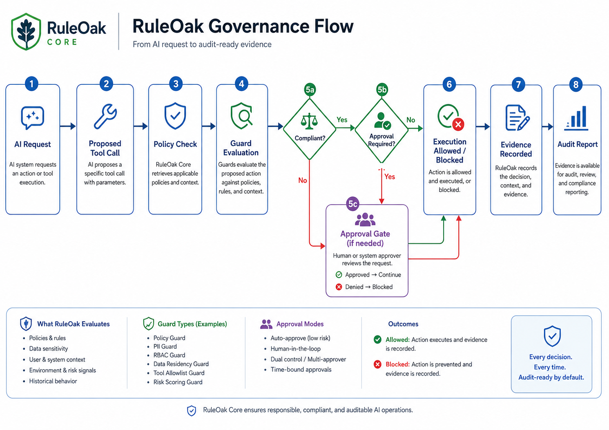

# RuleOak Core Documentation

RuleOak Core is a TypeScript runtime library for governing AI tool calls before execution. It provides guard and policy checks, approval gates, evidence records, audit reports, and protocol conformance tools.

```text
Declare tool call → Evaluate policy → Decide allow / approve / block → Pause for approval when required → Record evidence and audit events → Validate and export audit report
```

Use this documentation in the order below. It is organized for developers evaluating the v2.1.0 release.



Also see the [Visual guide](diagrams/README.md) for the full 15-diagram architecture, workflow, connectors, deployment, and protocol set.

## 1. Start

- [Developer usage](adoption/developer-usage.md) — source preview and local tarball install paths
- [10-minute quickstart](adoption/10-minute-quickstart.md) — run the governance loop locally
- [Quickstart reference](quickstart.md) — older sample app reference
- [Runtime lifecycle](runtime-lifecycle.md) — how governance records are produced

## 2. Understand the governance loop

- [Why RuleOak](why-ruleoak.md)
- [Tool Guard](tool-guard.md)
- [Policy packs](policy-packs.md)
- [Approval inbox](approval-inbox.md)
- [Audit Report Viewer v2](observability/report-viewer-and-telemetry.md)
- [Governance Protocol v1](protocol/governance-records-v1.md)
- [Protocol conformance kit](protocol/conformance-kit.md)

## 3. Run examples that map to the loop

- [AI Coding Agent Governance](ai-coding-agent-governance.md)
- [Enterprise RAG Answer Governance](enterprise-rag-answer-governance.md)
- [Personal Local-First Assistant Governance](personal-local-first-assistant-governance.md)
- [Ops Change Governance](sre-monitoring-change-governance.md)
- [Reference Verticals Overview](reference-verticals.md)

## 4. Integrate with agent stacks

- [MCP Guard](mcp-guard.md)
- [MCP Guard Proxy](mcp-guard-proxy.md)
- [LangGraph and CrewAI adapters](adapters/langgraph-crewai.md)
- [Real framework examples](adapters/real-framework-examples.md)
- [Python SDK bridge](integrations/python-sdk.md)

## 5. Connect evidence safely

- [Evidence connectors](evidence-connectors.md)
- [GitHub/Jira read-only connector pattern](connectors/github-jira-readonly.md)
- [Real evidence connectors v1](connectors/real-evidence-connectors-v1.md)
- [Connector reliability](connectors/connector-reliability.md)

## 6. Trust, claims, and boundaries

- [Trust model](trust-model.md)
- [Security model](trust/security-model.md)
- [Claims language](trust/claims-language.md)
- [AGPL and commercial boundary](trust/agpl-commercial-boundary.md)
- [Validation matrix](trust/validation-matrix.md)
- [Release boundaries](release-boundaries.md)
- [Threat model](security/threat-model.md)
- [Sandbox boundaries](security/sandbox-boundaries.md)

## 7. Release and launch references

- [Release notes](../RELEASE_NOTES.md)
- [Release versioning](release-versioning.md)
- [Public launch checklist](launch/public-launch-checklist.md)
- [Package publish guardrails](launch/package-publish-guardrails.md)
- [GitHub release guidance](launch/github-release-guidance.md)
- [Demo sequence](launch/demo-sequence.md)

## Compatibility wording

After running the conformance kit, use narrow wording:

> Compatible with `ruleoak.governance.v1` using the RuleOak Protocol Conformance Kit.

Do not call compatibility certified, audited, regulator-approved, or compliance-approved unless you have separate independent evidence.
