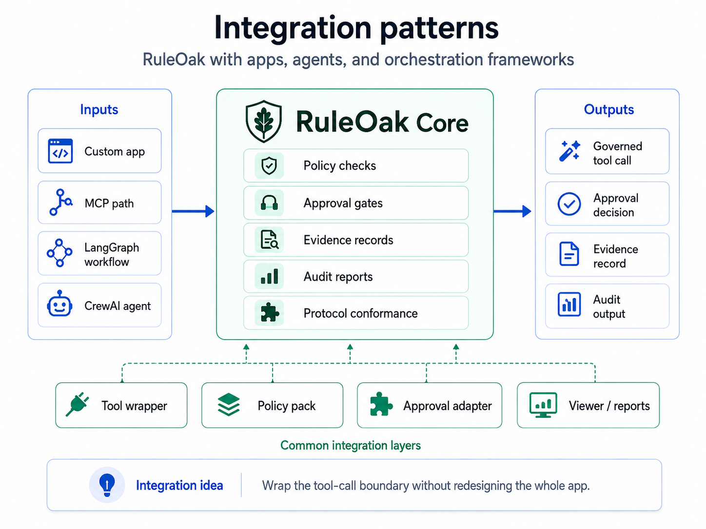
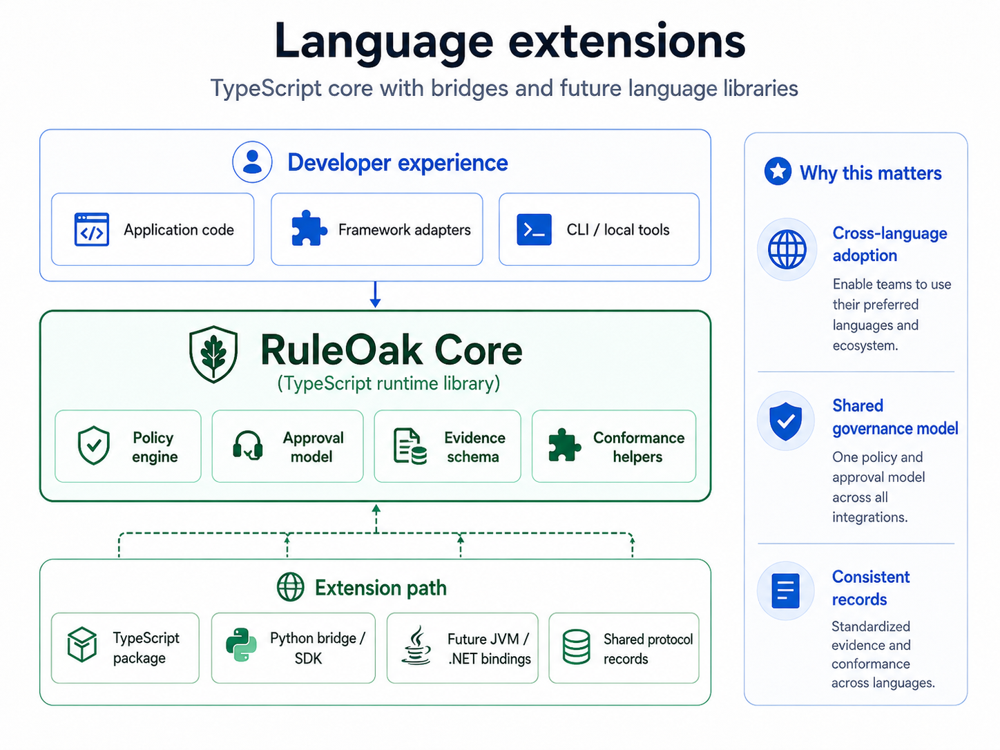

# Real framework examples






RuleOak Core v2.1.0 includes real-framework-ready examples for LangGraph, CrewAI, MCP-style tools, and coding-agent loops.

The goal is external developer adoption: a developer should see where RuleOak fits without reading the whole project.

## Integration pattern

```text
existing framework tool call
-> RuleOak policy decision
-> evidence / approval / audit record
-> execute, pause, or block
```

RuleOak does not replace the agent framework. It adds a governance boundary before the framework executes a tool.

## Commands

```bash
npm run adapter:real:all
npm run adapter:real:check
```

Individual commands:

```bash
npm run adapter:langgraph:real
npm run adapter:crewai:real
npm run adapter:mcp:real
npm run adapter:coding-agent:real
```

## What the examples prove

| Example | Allowed | Approval required | Blocked |
|---|---|---|---|
| LangGraph | read/search node | repository write | destructive workspace delete |
| CrewAI | summarize ticket | external message | customer-account deletion |
| MCP local proxy | `search_docs` | `send_external_message` | `delete_workspace_file` |
| Coding agent | read file / run tests | write file / push main | `rm -rf` / secret read |

## Dependency stance

The LangGraph and CrewAI examples are optional-dependency examples. They run without those packages so CI and first-time users stay fast. If the packages are installed, the same wrapper functions show the boundary to place around real framework tools.

## Safety wording

Use this wording externally:

> RuleOak evaluates tool calls before execution and records the decision, evidence, approval state, and audit trail.

Avoid this wording:

> Any broad claim that the library alone makes an agent safe.

RuleOak is a governance boundary. It does not replace operating-system sandboxing, identity controls, production secrets management, or framework-specific security controls.
