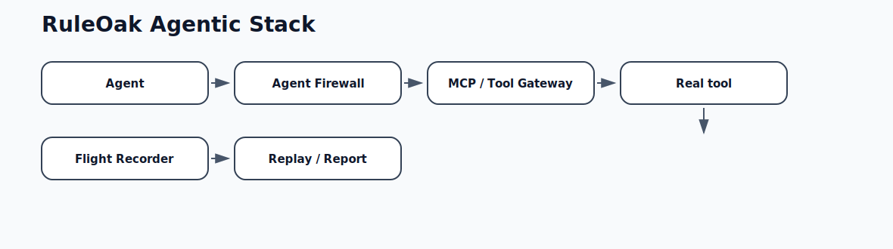
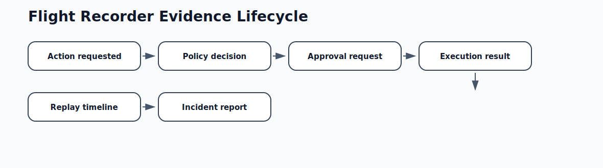
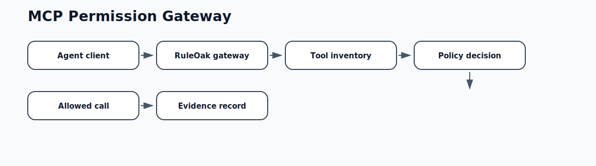
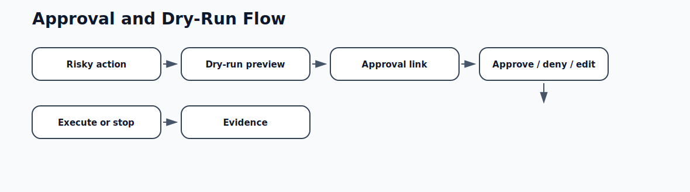
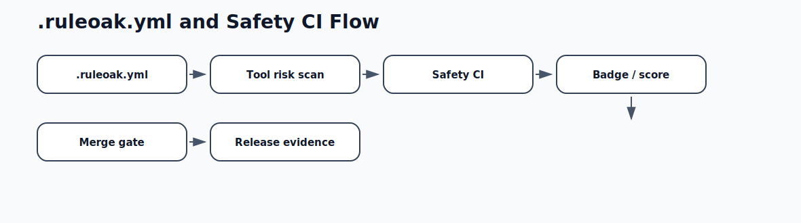
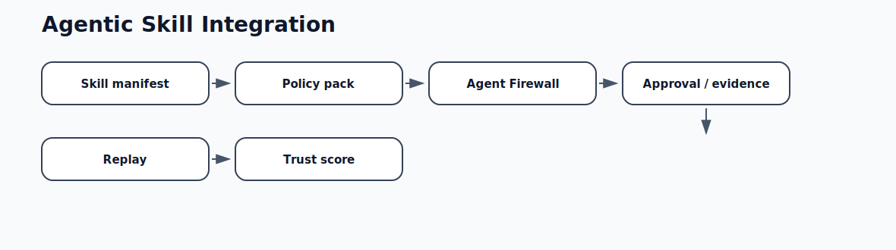
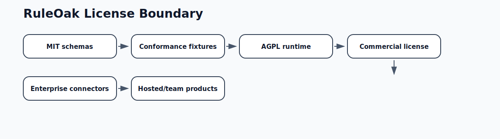

# RuleOak Agentic Diagrams

Each diagram is intended to be shown one by one at equal width in README, docs, and website pages.

## Agentic stack

## Flight recorder lifecycle

## MCP permission gateway

## Approval and dry-run flow

## Manifest and Safety CI flow

## Agentic skill integration

## License boundary

## Developer adoption loop

## Policy precedence

RuleOak Core follows the RuleOak policy model:

1. `blockedActions` always wins.
2. `allowedActions` and `approvalRequired` are compared by pattern specificity.
3. If allow and approval match with the same specificity, `needs_approval` wins.
4. `defaultAction` applies only when no explicit policy pattern matches.

Exact action keys such as `filesystem.read` are more specific than namespace wildcards such as `filesystem.*`, and `*` is the least-specific catch-all.
