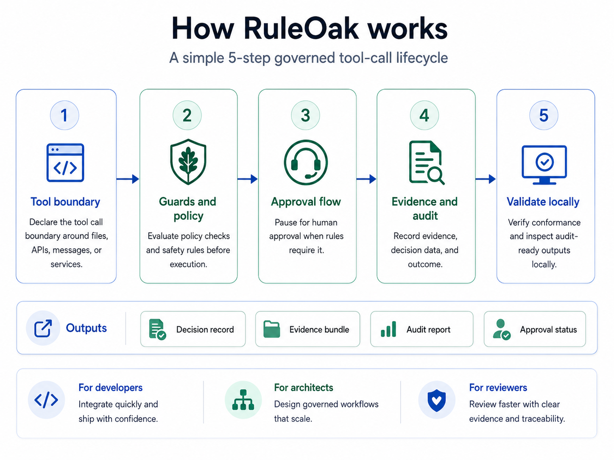
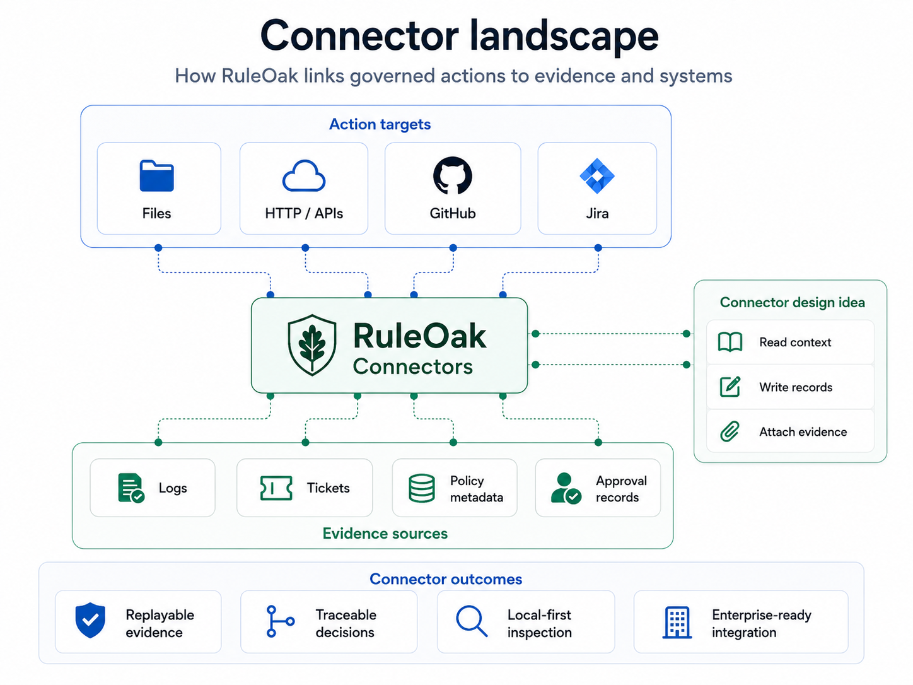
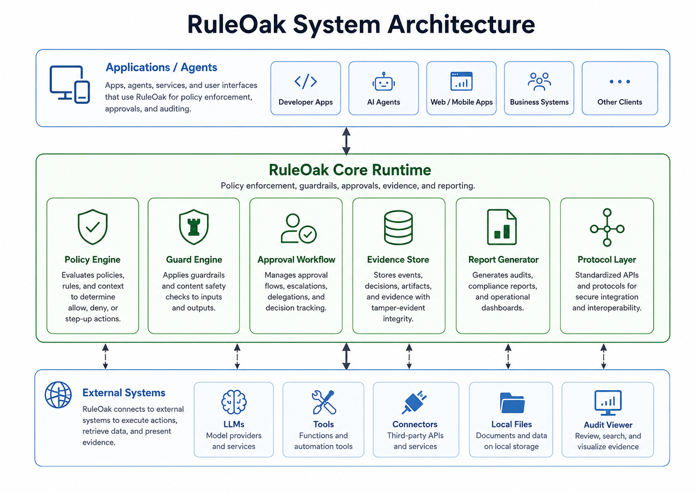

# RuleOak Core Visual Guide

This page groups the 15 RuleOak Core diagrams added for GitHub documentation. Use it as a visual index for developers, architects, and business reviewers.

## 1. Product overview and value

### RuleOak Core overview

Shows the overall product shape: application and agent entry points, the core runtime, and external systems.

### Who benefits from RuleOak

Shows how developers, architects, business stakeholders, and governance owners benefit from the same runtime.

### How RuleOak works in a 5-step flow

Maps to the main quickstart sequence used across the README and examples.

## 2. Governance flow, policy, and approvals

### Governance flow

An end-to-end view from AI request, proposed tool call, policy check, and guard evaluation through approval, execution, evidence, and audit report.

### Policy decision flow and approvals

Explains allow, block, and approval-required outcomes with common approval modes.

### Policy packs and guards

Shows how reusable policy packs feed the Guard Evaluator and produce allow, block, approval, and evidence outcomes.

## 3. Protocol, records, and auditability

### Protocol and records model

Explains the `ruleoak.governance.v1` record family and how records compose into an audit packet or governance report.

### Evidence-to-audit pipeline overview

Shows the evidence chain from raw inputs through reports and audit packets.

## 4. Connectors, integrations, and extension paths

### Connector landscape and outcomes

Shows how local files, GitHub, Jira, and enterprise evidence connectors contribute governed evidence.

### Integration patterns for RuleOak

Explains where RuleOak sits relative to LangGraph, CrewAI, MCP-style tools, and agent applications.

### Language extensions for TypeScript implementation

Shows how a TypeScript core can extend into Python bridges, adapters, and future SDK paths.

## 5. Deployment, operating model, and use cases

### Deployment options

Shows developer workstation, enterprise service, and embedded-product deployment patterns using the same RuleOak Core.

### Local-first operating model

Explains the local-first boundary: local evidence, local approval, and local review.

### System architecture

A system view spanning applications, agents, RuleOak Core runtime modules, and external systems.

### Refining use cases and workflows

Shows how the same governance loop applies across multiple verticals and workflow patterns.

## 6. Recommended reading order

1. [Why RuleOak](../why-ruleoak.md)
2. [10-minute quickstart](../adoption/10-minute-quickstart.md)
3. [Policy packs](../policy-packs.md)
4. [Governance Protocol v1](../protocol/governance-records-v1.md)
5. [Evidence connectors](../evidence-connectors.md)
6. [Real framework examples](../adapters/real-framework-examples.md)
7. [Stable local-first governance layer](../stable-local-governance-layer.md)
8. [Reference verticals](../reference-verticals.md)
