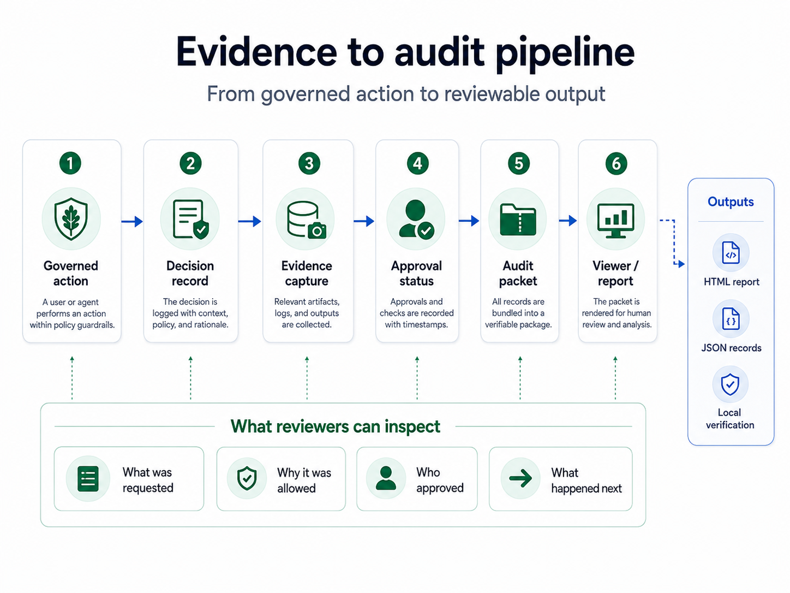

# Report Viewer and OpenTelemetry-style Export




RuleOak Core v2.2.0 includes the local report viewer and adds local OpenTelemetry-style export.

## Local report viewer

```bash
npm run demo
npm run viewer:build
npm run report:view
```

The viewer renders one-page HTML reports and writes `reports/html/catalog.json` for indexing.

## Telemetry export

```bash
npm run telemetry:export
```

Generated files:

- `reports/telemetry/ruleoak-otel-events.jsonl`
- `reports/telemetry/ruleoak-otel-spans.json`

The export is local-only. RuleOak does not send telemetry to an external collector in v2.2.0.

## Why this matters

Governed AI workflows need operational visibility:

- how many tool calls were allowed, denied, or approval-gated
- which approvals are pending
- which evidence records supported decisions
- how many risky actions were blocked

v2.2.0 provides a stable local export pattern that can later be connected to enterprise observability systems.
