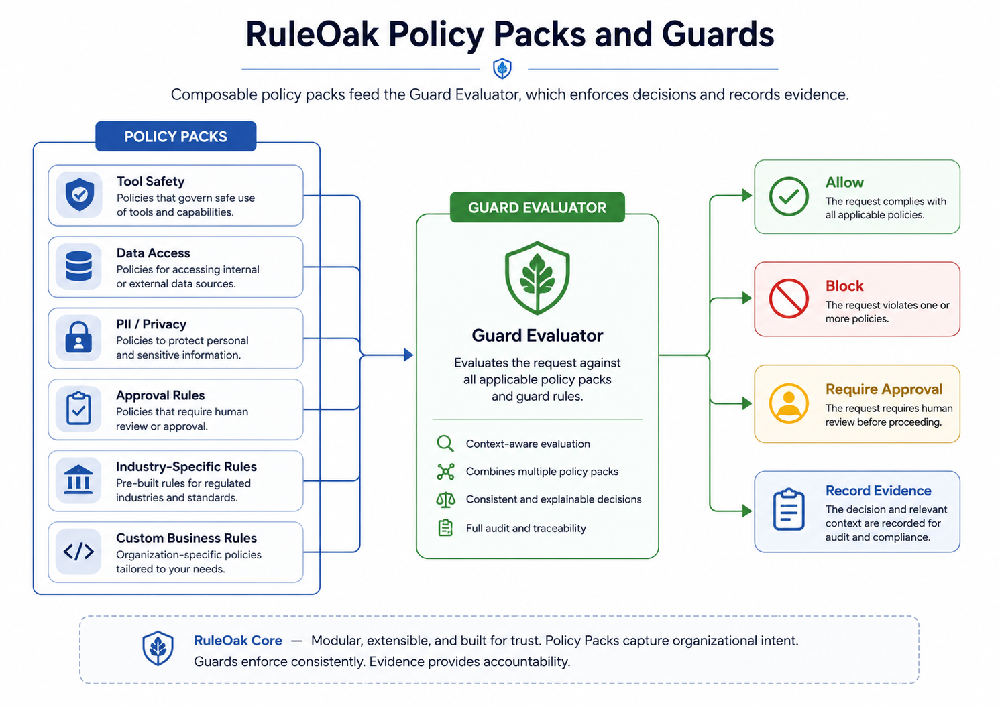
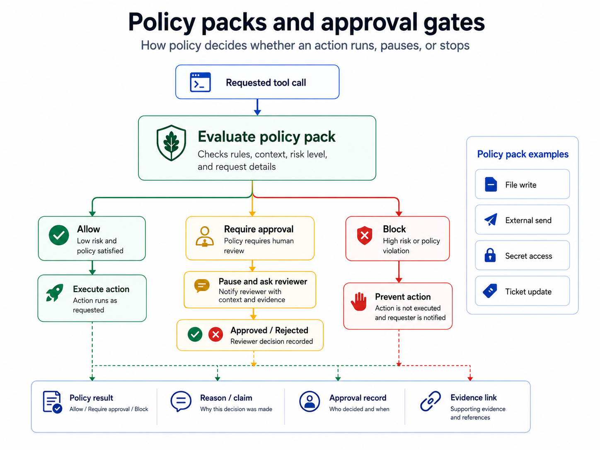

# RuleOak Policy Packs






RuleOak Core v2.1.0 includes reusable policy packs.

A policy pack is a small, versioned bundle of policy defaults for a common agent risk area. Packs can be combined and then used by Tool Guard, MCP Guard, adapter samples, and connector demos.

## Included packs

- `filesystem-safe` — read/list actions allowed, writes approval-gated, destructive filesystem actions blocked.
- `external-communication` — drafts allowed, external sends approval-gated, bulk sends blocked.
- `ticketing-readonly` — ticket reads allowed, ticket writes blocked.
- `ticketing-write-approval` — ticket reads allowed, ticket comments/transitions approval-gated.
- `cloud-llm-approval` — local LLM allowed, cloud LLM approval-gated, raw data upload blocked.
- `pii-redaction` — redaction allowed, raw PII export blocked.

## Commands

```bash
npm run policy:packs:list
npm run policy:demo
npm run test:policy-packs
```

## Why this matters

Policy packs turn governance from one-off demo configuration into reusable safety defaults. They make RuleOak easier to apply without redesigning an app or putting control rules inside the prompt.

## Boundary

The packs are developer defaults, not legal or compliance advice. Review and adapt policies before using them in production or regulated workflows.
