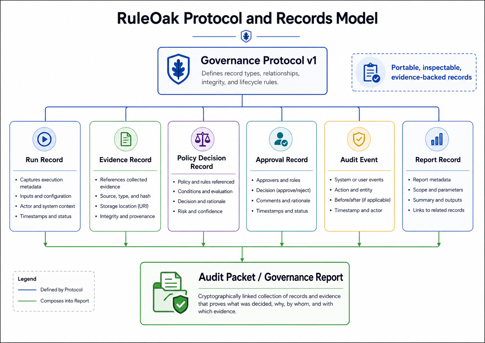

# RuleOak Governance Record Protocol v1




RuleOak Governance Protocol v1 is the stable, schema-backed record contract for governed AI tool-call workflows in RuleOak Core v2.x and future major releases.

The protocol name is:

```text
ruleoak.governance.v1
```

The product version and protocol version are intentionally separate. RuleOak Core can move through v2.x and future major releases while the governance record protocol remains v1.

## Goal

Protocol v1 gives RuleOak a common record shape for policy decisions, evidence records, approvals, audit events, runs, and reports.

This allows TypeScript Core, Python SDK fixtures, MCP paths, adapter examples, evidence connectors, approval workflows, and report viewers to exchange governance records consistently.

## Common fields

Every protocol record uses:

```json
{
  "schemaVersion": "ruleoak.governance.v1",
  "recordType": "RunRecord"
}
```

## Record types

- `RunRecord`
- `EvidenceRecord`
- `ApprovalRecord`
- `AuditEvent`
- `PolicyDecisionRecord`
- `ReportRecord`

## Stability contract

Protocol v1 is governed by the [stability contract](stability-contract.md):

- required fields are not removed within protocol v1
- existing enum meanings are not changed within protocol v1
- new optional fields may be added when backward compatible
- deprecated fields remain readable for a documented transition period
- breaking changes require a new protocol line, such as `ruleoak.governance.v2`

## Conformance

Run:

```bash
npm run protocol:status
npm run protocol:conformance
npm run protocol:python
npm run test:protocol
```

The conformance kit validates golden records under `tests/conformance/golden-records/` against the required RuleOak fields.

## Boundary

This protocol is a stable compatibility contract for RuleOak governance records. It is not a legal compliance standard and does not certify any workflow.


- [Protocol v1 hardening](protocol/protocol-v1-hardening.md)
- [Evidence bundles](protocol/evidence-bundles.md)
