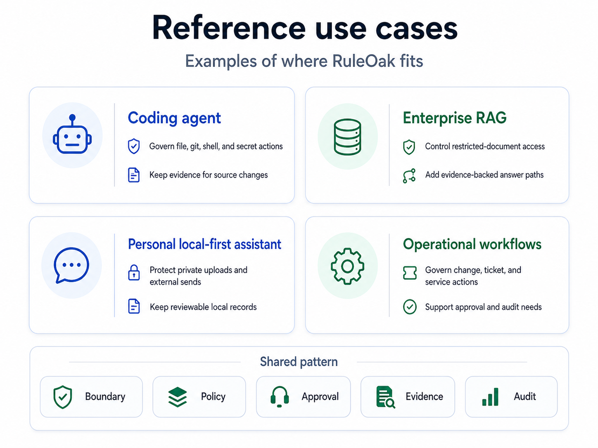

# RuleOak Reference Verticals

RuleOak Core public latest release is v2.1.0. The reference verticals in v2.1.0 show how the same governance protocol applies beyond SRE.

| Vertical | Command | Developer audience | Governance pattern |
|---|---|---|---|
| SRE monitoring change | `npm run sre:monitoring-change` | SRE and platform teams | Production write requires approval; unsafe alert disable is blocked |
| AI coding agent | `npm run coding:agent-governance` | Coding-agent and IDE developers | File/git/shell actions are governed before execution |
| Enterprise RAG answer | `npm run rag:answer-governance` | RAG and internal knowledge-bot developers | Answers require evidence; restricted documents are gated |
| Personal local-first assistant | `npm run personal:local-assistant-governance` | Local-first and indie app developers | Local reads are allowed; external sends require approval; private upload is blocked |

Each vertical writes governance records, an evidence bundle, an approval request, an append-only audit log, a JSON report, and an HTML report under its `examples/<vertical>/out/` folder.
