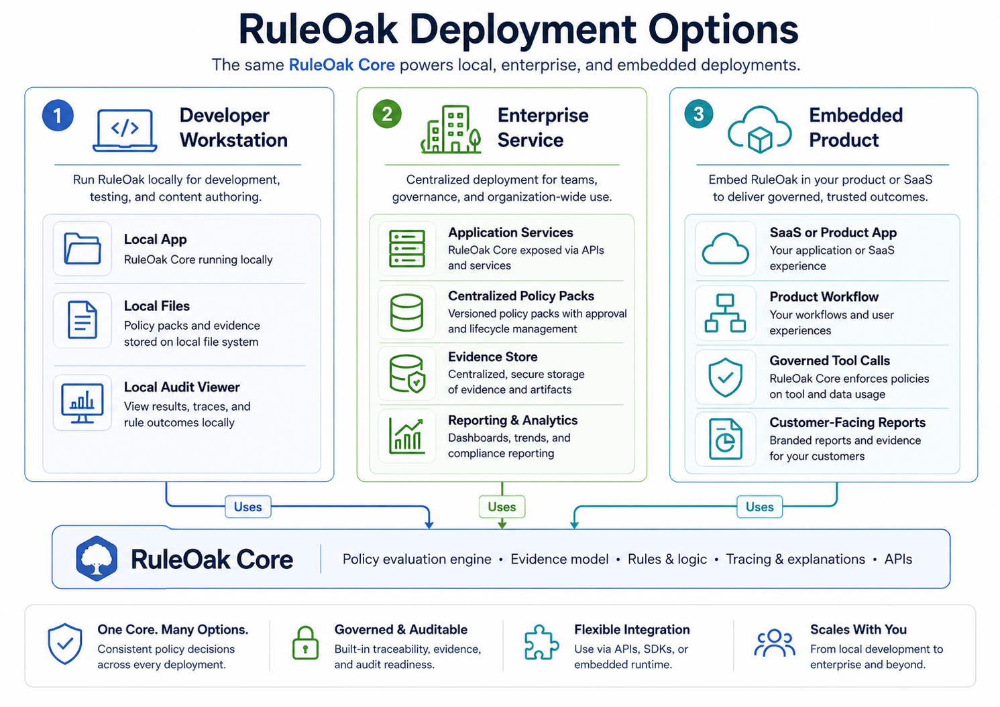
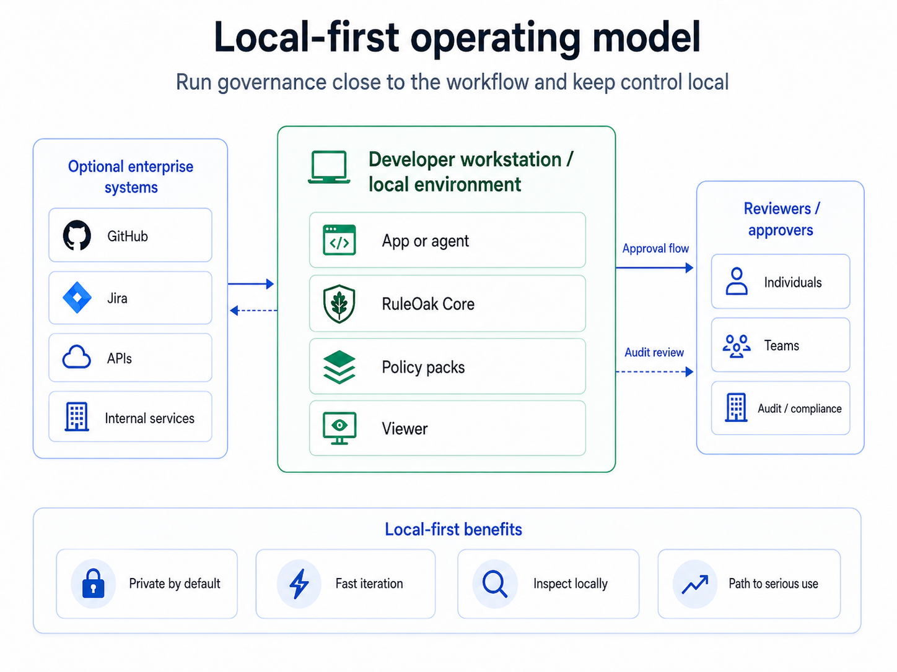

# Stable Local-first Governance Layer

RuleOak Core is a local-first governance layer for AI tool calls.

The latest public GitHub release is **v2.1.0**. This archive also contains **RuleOak Core v2.1.0 public-release work** with v2.1.0 package metadata for future validation. Treat future major releases references in this package as unreleased until a future major release is actually published.

The current governance stack combines:

- Tool Guard for allow / deny / approval-required decisions before execution
- RuleOak Governance Protocol v1 as a stable, schema-backed record contract
- protocol conformance and Python SDK fixture conformance
- MCP Guard and local MCP proxy patterns
- LangGraph, CrewAI, and MCP adapter paths
- reusable policy packs
- Policy Test Lab for policy test / explain / diff
- local Approval Inbox
- HTML reports and report catalog
- GitHub and Jira read-only evidence connectors
- connector reliability controls
- security boundary, connector safety, MCP safety, and report snapshot tests
- release validation commands

## Product version versus protocol version

RuleOak Core uses `ruleoak.governance.v1`.

This is intentional. Product releases can move forward while the governance record protocol remains stable. Breaking record-shape changes require a future protocol line such as `ruleoak.governance.v2`.

## Boundary

RuleOak Core is a local-first developer governance layer. It is not a certified compliance product, externally security-reviewed sandbox, hosted cloud service, or guarantee that an AI system is safe.
