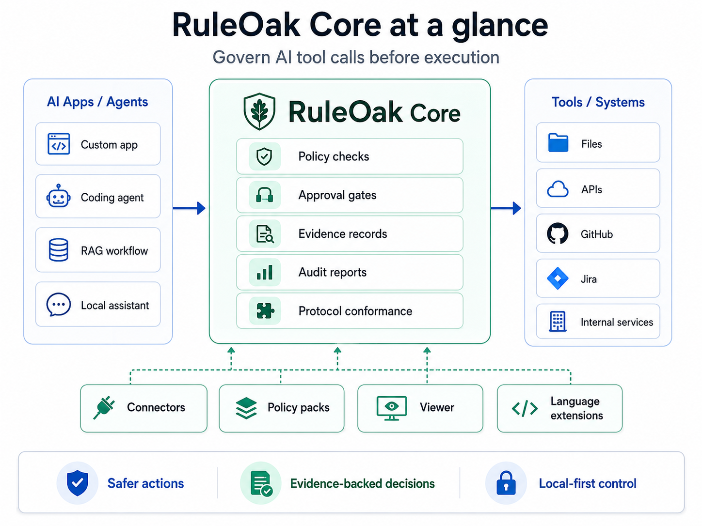
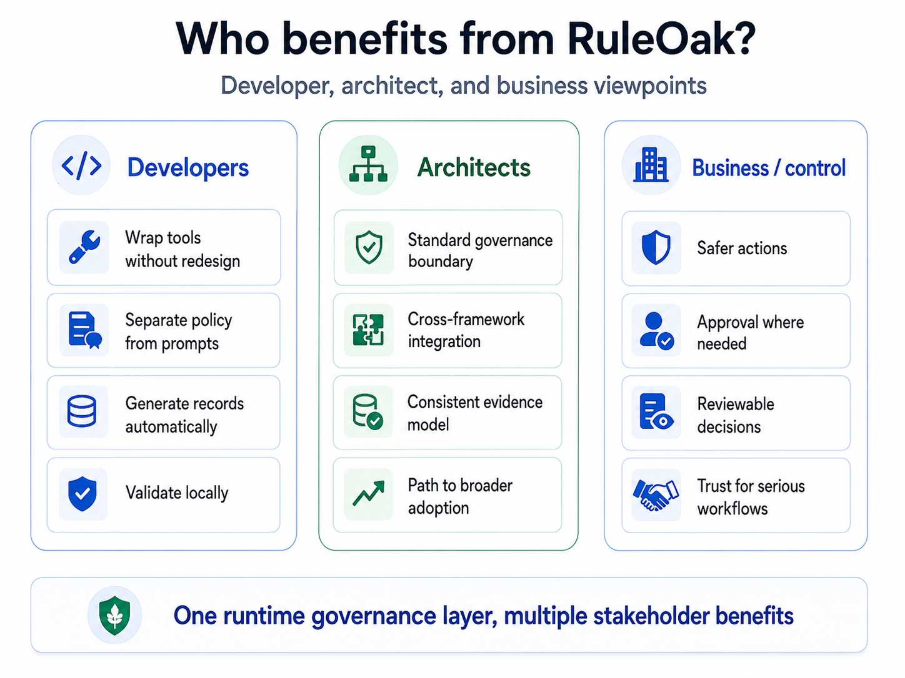

# Why RuleOak






RuleOak Core is for developers who want to build useful AI workflows without losing control over what the agent is allowed to do.

## The problem

Agent apps often begin as a prompt plus tool calls. That is fast, but the design becomes fragile when the workflow touches real files, production systems, business decisions, or customer data.

Common problems:

- tool permissions are hidden in code or prompts;
- recommendations do not clearly show evidence;
- risky actions do not pause for approval;
- audit trails are incomplete;
- vertical apps duplicate the same safety and governance patterns.

## The RuleOak approach

RuleOak makes the control model explicit:

```text
Policy   → allowed, blocked, or approval-gated actions
Evidence → facts supporting the recommendation
Approval → human review before risky execution
Audit    → what happened, why, and under which boundary
```

## What is cool in this release

This first public release is intentionally small, but it includes the key shape of the platform:

1. **Generic Technical Consultant demo**  
   A copyable example that turns alert-like input, notes, metrics, and logs into an evidence-backed report.

2. **Policy-gated action proposal**  
   The example recommends an action but blocks execution when approval is required.

3. **Audit-style output**  
   The demo writes a structured report that can be inspected, saved, or adapted.

4. **Copy-and-adapt app creation**  
   Use `npm run create:app -- my-consultant-app` to create a local app from the demo.

5. **Vertical-ready structure**  
   The same core pattern can support technical consulting, research, knowledge workflows, document review, compliance workflows, and other vertical apps.

## Competitive angle

RuleOak is not trying to replace every agent framework.

RuleOak focuses on a narrower but important layer:

> governed agent execution for vertical apps.

Use RuleOak when you care less about "how autonomous can this agent be?" and more about:

> "Can I understand, control, approve, and audit what this agent is doing?"


## Professional review stance

Professional reviewers should read this as a pattern-first preview, not as a finished enterprise platform.

The release is intentionally small. It tries to prove one useful idea:

> AI workflows should start with policy, evidence, approval, and audit — not add them later as afterthoughts.

RuleOak does not claim that governance, approval, audit, or workflow control are new ideas. The differentiation is applying them directly to agentic vertical-app development from day one.


## Why two demos are included

The first launch includes two demos on purpose:

```text
technical-consultant-demo  action-oriented case analysis
research-brief-demo        non-IT evidence and recommendation workflow
```

This proves the core abstraction is not tied to one domain. The shared pattern is:

```text
policy boundary
+ evidence quality
+ approval decision
+ audit-style record
```
